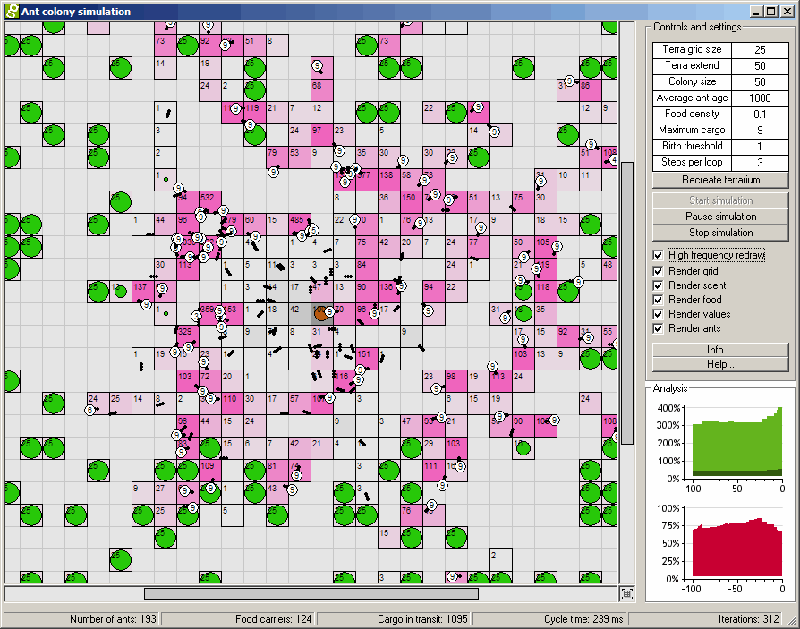



## Ant colony simulation

### Description

(Updated version 28-07-2004)

Simulate the behaviour of an Ant colony. This is an experiment of a system with 'intelligent' agents who affect and are affected by their environment and counterparts.
 
### More Info
 
Several settings can be changed at run-time and several others at design-time.

Seems to be having some problems on win98. Can only test it on Win2K and XP myself so fixes are unlikely from my end)

New uploaded version. Seems to be stable.

             |
---                |---
**Submitted On**   |2004-07-23 11:06:48
**By**             |[David Rutten](https://github.com/Planet-Source-Code/PSCIndex/blob/master/ByAuthor/david-rutten.md)
**Level**          |Intermediate
**User Rating**    |4.9 (98 globes from 20 users)
**Compatibility**  |VB 5\.0, VB 6\.0
**Category**       |[Complete Applications](https://github.com/Planet-Source-Code/PSCIndex/blob/master/ByCategory/complete-applications__1-27.md)
**World**          |[Visual Basic](https://github.com/Planet-Source-Code/PSCIndex/blob/master/ByWorld/visual-basic.md)
**Archive File**   |[Ant\_colony1775017282004\.zip](https://github.com/Planet-Source-Code/david-rutten-ant-colony-simulation__1-55195/archive/master.zip)

### API Declarations

several GDI drawing calls and some other API methods.

